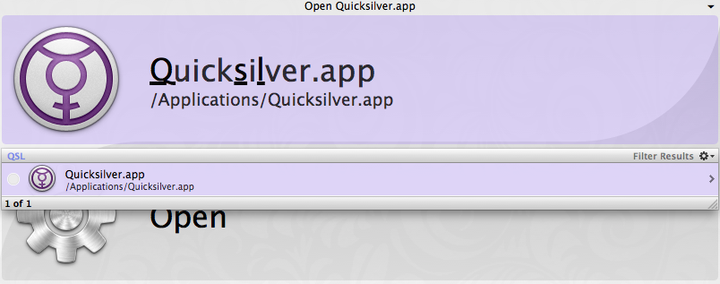
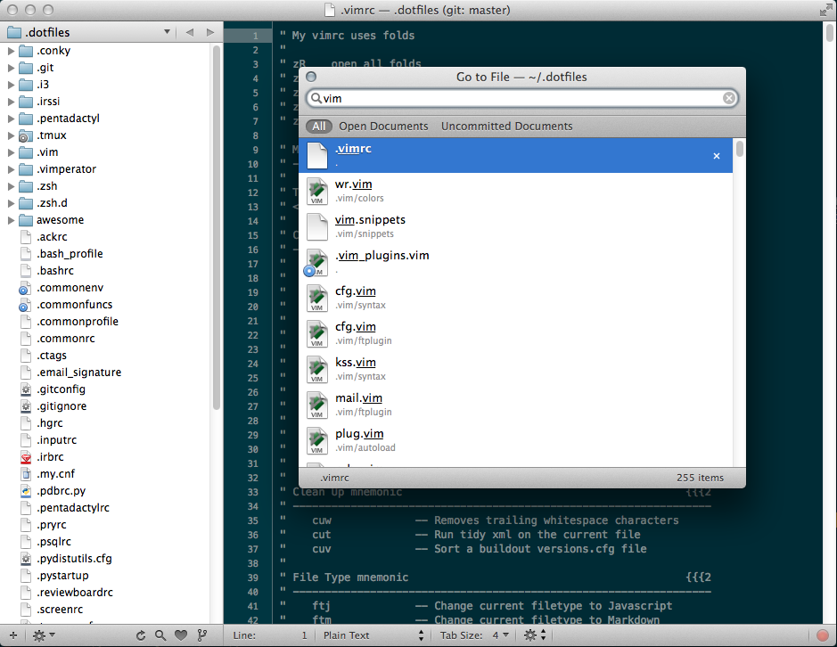
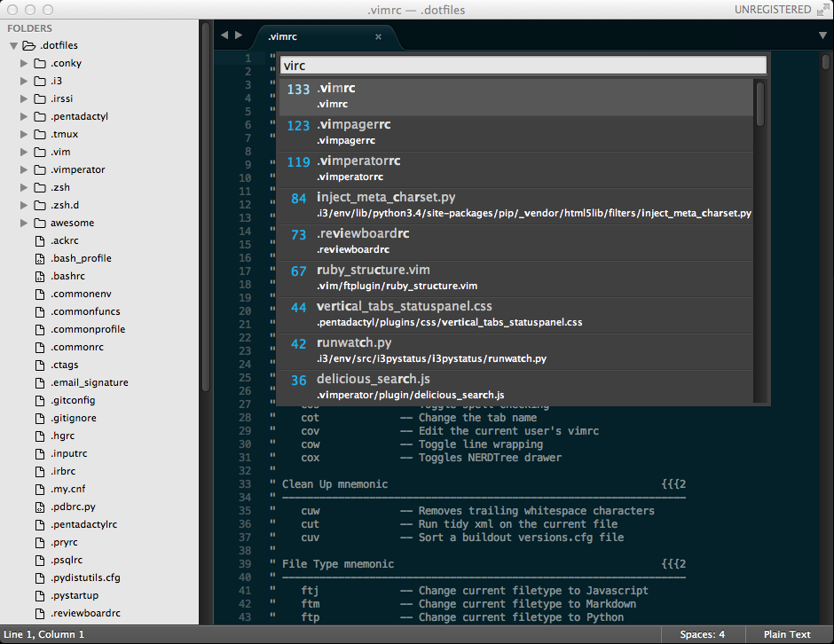
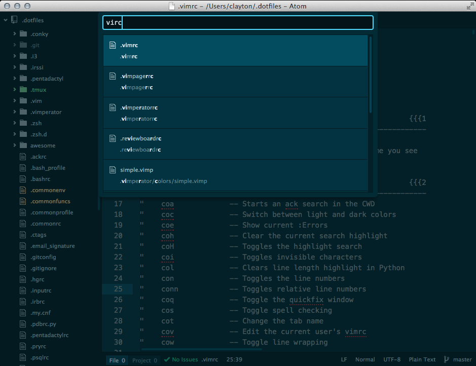

autoscale: true

## [fit] __*Fuzzy*__ Feelings for
## [fit] Fuzzy __*Matching*__

<br>

### [@claytron][] | _VimIndy_ | 02.2015

-------------------------------------------------------------------------------

# [fit] You __*Love*__ It Already.


^ Spotlight...

-------------------------------------------------------------------------------

# [fit] You __*Love*__ It Already.



^ QuickSilver
...or other launchers

-------------------------------------------------------------------------------

# [fit] You __*Love*__ It Already.



^ You've used it in your favorite editor
...TextMate at some point perhaps?

-------------------------------------------------------------------------------

# [fit] You __*Love*__ It Already.



^ Sublime

-------------------------------------------------------------------------------

# [fit] You __*Love*__ It Already.



^ ...and Atom too
Jealous of the speed.

-------------------------------------------------------------------------------

# [fit] In __*Vim*__, You Tried...
- __Fuzzy Finder__
- __Command-T__
- __CtrlP__

![][fail]

^ Fuzzy Finder was cool, complex.
and slow with many files...

^ Command-T required ruby and a make file or something.
Inspired by TextMate.

^ CtrlP inspired by Sublime Text.
Pure vim. Pure slow.

-------------------------------------------------------------------------------

# [fit] Now What?

![][future]

-------------------------------------------------------------------------------

# [fit] [FZF!][fzf]

-------------------------------------------------------------------------------

# Install is easy[^1]

```sh
$ git clone --depth 1 https://github.com/junegunn/fzf.git ~/.fzf
$ ~/.fzf/install
```

[^1]: As long as you are on a supported platform. Otherwise, you need to create a binary.

-------------------------------------------------------------------------------

# My Settings

```sh
# My defaults for FZF (mostly changed to see hidden files)
export FZF_DEFAULT_COMMAND='find -L . -type f -o -type d -o -type l | sed 1d | cut -b3- | grep -v -e .git/ -e .svn/ -e .hg/'
export FZF_CTRL_T_COMMAND=$FZF_DEFAULT_COMMAND

# Enhance the default experience
export FZF_DEFAULT_OPTS='--extended --multi --inline-info --prompt="fzf> "'
```

^ I've been using it for a while.
  Customized it to my needs.

-------------------------------------------------------------------------------

# Use Cases

![][vim]

^ Let's look at how it can be used in Vim.

-------------------------------------------------------------------------------

Find __*Files*__ in Vim


![][vim]

^ :star: [Watch the Video][fzf_vim_files] :star:

^ 'README' Open it.
'fo' finds 'fortune.rb'
'fo.rb' finds 'info.rb'
Exclude with '!^.bu'
Open multiple files
Or statements

-------------------------------------------------------------------------------

Find __*Buffers*__ in Vim


![][vim]

^ :star: [Watch the Video][fzf_vim_buffers] :star:

^ Now we have open buffers
Details + fuzzy match
Filter by 'md'
Open that file

-------------------------------------------------------------------------------

Find __*Recent Files*__ in Vim


![][vim]

^ :star: [Watch the Video][fzf_vim_mru] :star:

^ Files from previous sessions
Quick fuzzy access

-------------------------------------------------------------------------------

Switch __*Color Schemes*__ in Vim


![][vim]

^ :star: [Watch the Video][fzf_vim_colors] :star:

^ Not just files
Open Colors
Find 'ze'. Select Zenburn
Find 'mo'. Select molokai
Find 'toni'. Select tomorrow night

-------------------------------------------------------------------------------

# Outside Vim

![][outside]

-------------------------------------------------------------------------------

Find __*Files*__


![][outside]

^ :star: [Watch the Video][fzf_shell_files] :star:

^ Use 'sed -n' with ctrl-t
Use 'wc -l' with 'lib' path and '`**`'

-------------------------------------------------------------------------------

Inspect __*Environment*__


![][outside]

^ :star: [Watch the Video][fzf_shell_env] :star:

^ Use ctrl+r
Find the env command
Search for FZF

-------------------------------------------------------------------------------

__*Git Stash*__ Helper


![][outside]

^ :star: [Watch the Video][fzf_shell_stache] :star:

^ Default git stash list
Show different stashes
Apply one

-------------------------------------------------------------------------------

### [fit] junegunn on GitHub

![][junegunn]

^ Prolific and clean code

^ You will see this face pop up on the slack channel for sure :)

-------------------------------------------------------------------------------

# [fit] FIN

![][finish]

-------------------------------------------------------------------------------

### Links

1. [FZF][fzf]
1. [fzf.vim][fzf.vim]
1. [Custom MRU Setup in Vim][mru_vim]
1. [My FZF Config][fzf_config]
1. [My .dotfiles][dotfiles]
1. [VimIndy][]

![right filtered][links]

-------------------------------------------------------------------------------

### Image Credits

1. [In Vim, You Tried (blondinrikard @ flickr)][fail_credit]
1. [Now What? (llnataliell @ flickr)][future_credit]
1. [Use Cases (fudj @ flickr)][vim_credit]
1. [Outside Vim (claytron @ flickr)][outside_credit]
1. [fin (philon @ flickr)][finish_credit]
1. [Links (volvob12b @ flickr)][links_credit]

[:arrow_left: This Image (drp @ flickr)][images_credit]

Made possible by [Creative Commons ![][cc_logo]][cc]

![left filtered][images]

[//]: # ( ------------------------------------------------------------------- )
[//]: # ( Links to items mentioned in the presentation )
[//]: # ( ---- )
[fzf]: https://github.com/junegunn/fzf
[fzf.vim]: https://github.com/junegunn/fzf.vim
[mru_vim]: https://gist.github.com/claytron/6d3fd25104729f04cbc8
[fzf_config]: https://gist.github.com/claytron/d057345985ef29bd40d6
[dotfiles]: https://github.com/claytron/dotfiles
[@claytron]: https://twitter.com/claytron
[vimindy]: http://www.meetup.com/vimindy/

[//]: # ( ---- )
[//]: # ( External video links )
[//]: # ( ---- )
[fzf_vim_files]: https://youtu.be/u8hFhBd--Bs
[fzf_vim_buffers]: https://youtu.be/2YlrPAYAZUg
[fzf_vim_mru]: https://youtu.be/IUybPb83l94
[fzf_vim_colors]: https://youtu.be/IT6T7bAMu2k
[fzf_shell_files]: https://youtu.be/ZxvV18osBRs
[fzf_shell_env]: https://youtu.be/U1baE0SIrks
[fzf_shell_stache]: https://youtu.be/RdAEkJCtFcU

[//]: # ( ---- )
[//]: # ( Links to images and their creditors )
[//]: # ( ---- )
[fail]: https://c2.staticflickr.com/6/5755/23073669710_3cd3970c54_b.jpg
[fail_credit]: https://flic.kr/p/B9WA8y
[future]: https://c1.staticflickr.com/3/2835/11425762834_a566aca52c_h.jpg
[future_credit]: https://flic.kr/p/ipE2dW
[vim]: https://c1.staticflickr.com/1/36/82932373_71e7e8a628_o.jpg
[vim_credit]: https://flic.kr/p/8k3Uv
[outside]: https://c2.staticflickr.com/2/1333/4599977246_63b6d7d5ac_o.jpg
[outside_credit]: https://flic.kr/p/81u5Yw
[junegunn]: https://avatars0.githubusercontent.com/u/700826
[finish]: https://c1.staticflickr.com/3/2267/2477878611_c7943ef03f_o.jpg
[finish_credit]: https://flic.kr/p/4LXLZ2
[links]: https://c1.staticflickr.com/3/2847/9769053784_d13b1715a8_h.jpg
[links_credit]: https://flic.kr/p/fTfXkN
[images]: https://c1.staticflickr.com/1/3/4886562_032e05c51a_o.jpg
[images_credit]: https://flic.kr/p/r3B5
[cc_logo]: http://mirrors.creativecommons.org/presskit/icons/cc.large.png
[cc]: https://creativecommons.org
[//]: # ( ------------------------------------------------------------------- )
